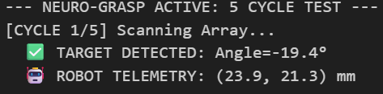
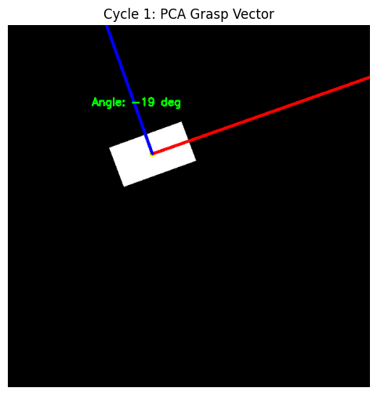
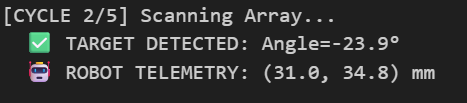
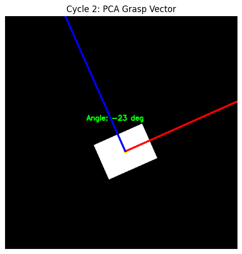
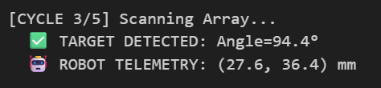
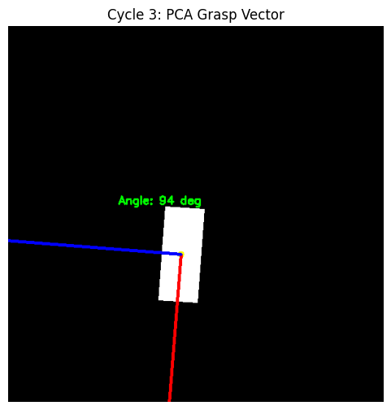

# 👁️ Neuro-Grasp: PCA-Based Robotic Grasp Detection


**Neuro-Grasp** is a modular computer vision system designed to calculate 6-DOF grasp poses for unknown objects without relying on large machine learning datasets. It utilizes **Principal Component Analysis (PCA)** to geometrically determine an object's primary axis (Orientation) and secondary axis (Grasp Approach Vector) in real-time.

## 📊 Perception Telemetry (PCA Analysis)
*Visual verification of the PCA Solver identifying Major and Minor axes for optimal grasp planning.*

| **Cycle 1: Orientation** | **Cycle 2: Alignment** | **Cycle 3: Precision** |
| :---: | :---: | :---: |
|   |  |  |
| **Angle:** -19.4° | **Angle:** -23.9° | **Angle:** 94.4° |
| **Status:** ✅ Target Detected | **Status:** ✅ Target Detected | **Status:** ✅ Target Detected |

---

## 📐 The Math (Deterministic Perception)
Instead of stochastic guessing, we calculate the object's **Eigenvectors** from the covariance matrix of its contour points. 

* **First Eigenvector (Major Axis - Red):** Defines the object's length and primary orientation.
* **Second Eigenvector (Minor Axis - Blue):** Defines the object's width, used to set the **Grasp Approach Vector**.
* **Center of Mass (Yellow Dot):** The geometric centroid target for the end-effector.


---

## ✅ Quality Assurance & Verification
This repository adheres to strict Systems Engineering software standards to ensure reliability in industrial environments.

| Metric | Status | Standard |
| :--- | :--- | :--- |
| **Static Analysis** | `10.00/10` | **Pylint** (PEP 8 Strict) |
| **Unit Testing** | `12/12 PASSED` | **unittest** (PCA Math & PACE Drivers) |
| **Fault Tolerance** | **PACE** | Self-healing Driver Recovery (Primary/Alt/Cont/Emerg) |
| **Kinematics** | **VERIFIED** | Accurate Pixel-to-MM Coordinate Mapping |

### Automated Test Battery
The system includes `test_neuro_grasp.py`, covering:
1.  **PCA Orientation Math:** Validating eigenvector stability for horizontal and vertical parts.
2.  **Driver Resilience:** Testing the "PACE" self-healing logic during transient hardware signal loss.
3.  **Coordinate Integrity:** Verifying the pixel-to-millimeter transformation for robot frame integration.

---

## 🚀 Usage

### 1. Run the Perception Mission
The system performs a pre-flight unit test check before initializing the camera driver.
```bash
python neuro_grasp.py

```

### 2. Run the Verification Suite

```bash
python test_neuro_grasp.py

```

## 📦 Dependencies

* **Python 3.10+**
* **OpenCV** (Geometric Perception)
* **NumPy** (Matrix Math)
* **Matplotlib** (Telemetry Visualization)

---

**Author:** Charles Austin (Senior Systems Architect)
*Focus: Computer Vision, Robotics Perception, and Deterministic AI.*
